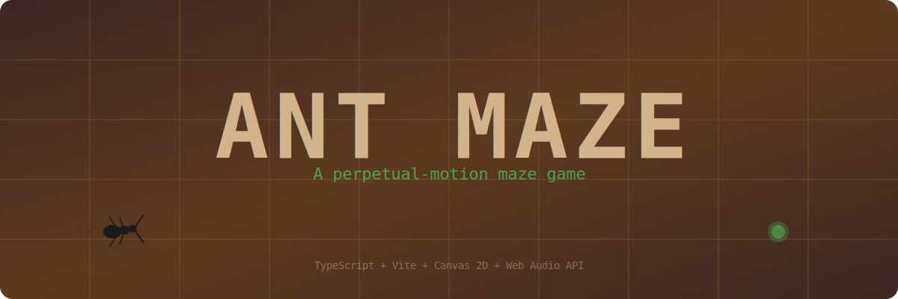
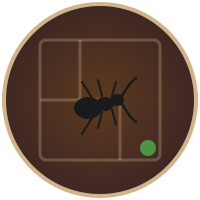
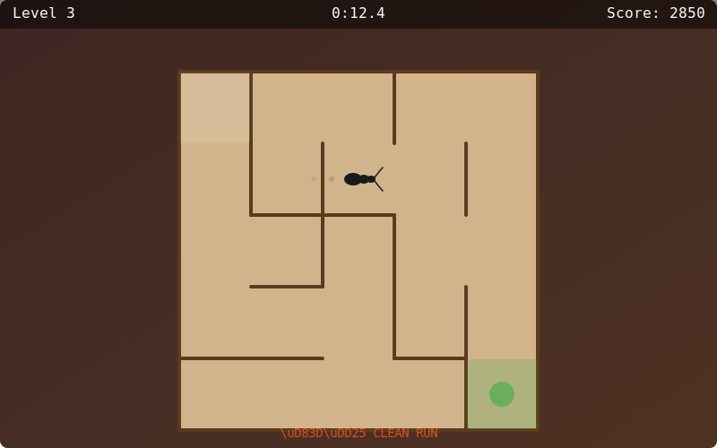

<p align="center">
  
</p>

<p align="center">
  
</p>

<h1 align="center">Ant Maze</h1>

<p align="center">
  
</p>

<p align="center">
  <strong>A perpetual-motion maze game built with TypeScript and Canvas 2D.</strong><br>
  Guide an ant through procedurally generated mazes. Don't touch the walls.
</p>

<p align="center">
  
  
  
  
  
</p>

---

## Gameplay

<p align="center">
  
</p>

The ant **never stops moving**. Use arrow keys or WASD to steer it through increasingly complex mazes. Touch a wall? Instant reset to the start. Reach the green goal to advance.

The core tension: the ant is always walking forward, so you need to think and react quickly to navigate tight corridors without clipping a wall.

### Features

- **Procedural mazes** generated with the recursive backtracker algorithm — every run is unique
- **Infinite levels** with scaling difficulty (7x7 grids up to 21x21, increasing speed)
- **Scoring system** with time bonus, level bonus, and a 1.5x streak multiplier for wall-free runs
- **Particle effects** — wall-hit dust bursts, level-complete confetti, screen shake
- **Procedural music** — LittleBigPlanet-inspired soundtrack generated entirely with Web Audio API
- **Sound effects** — wall thud, direction tick, level-complete jingle (all synthesized, zero audio files)
- **Mobile support** — responsive canvas with touch D-pad controls
- **HiDPI rendering** — pixel-crisp on Retina/high-DPI displays
- **Pause menu** with settings for independent music/SFX toggles
- **High score persistence** via localStorage
- **~31 KB** total bundle size (gzipped: ~10 KB) — no external assets

---

## Controls

| Input | Action |
|---|---|
| `Arrow Keys` / `WASD` | Steer the ant |
| `Escape` | Pause / Resume |
| `M` | Toggle mute |
| `Enter` | Select menu item |

On mobile, use the on-screen D-pad and speaker button.

---

## Getting Started

### Prerequisites

- **Node.js** 20+
- **npm** 10+

### Install & Run

```bash
git clone https://github.com/YOUR_USERNAME/ant-maze.git
cd ant-maze
npm install
npm run dev
```

Open [http://localhost:5173](http://localhost:5173) in your browser.

### Build for Production

```bash
npm run build
npm run preview
```

The optimized build is output to `dist/`.

### Run Tests

```bash
npm test
```

93 tests across 4 test suites: maze generation, collision detection, scoring formulas, and cross-device speed parity.

---

## Project Structure

```
ant-maze/
├── index.html           # Entry HTML with inline SVG favicon
├── src/
│   ├── main.ts          # Canvas setup, DPR handling, game bootstrap
│   ├── game.ts          # Game class — state machine, game loop
│   ├── maze.ts          # Recursive backtracker maze generation
│   ├── player.ts        # Ant entity — position, direction, movement
│   ├── renderer.ts      # All Canvas 2D drawing (maze, ant, trail, goal)
│   ├── collision.ts     # Circle-vs-line-segment wall collision
│   ├── input.ts         # Keyboard + touch D-pad input handler
│   ├── hud.ts           # In-game HUD overlay (level, timer, score)
│   ├── scoring.ts       # Score calculation and tracking
│   ├── particles.ts     # Particle system (wall hit, confetti)
│   ├── audio.ts         # Procedural music + SFX via Web Audio API
│   ├── constants.ts     # Tuning values (speed, colors)
│   └── types.ts         # Shared TypeScript types and enums
├── tests/
│   ├── maze.test.ts     # Maze generation and connectivity
│   ├── collision.test.ts # Collision detection
│   ├── scoring.test.ts  # Score formula verification
│   └── speed.test.ts    # Cross-device speed parity
├── assets/
│   ├── banner.svg       # GitHub banner
│   ├── logo.svg         # Project logo
│   └── gameplay.svg     # Gameplay preview
├── spec.md              # Original game specification
├── package.json
├── tsconfig.json
└── vite.config.ts
```

---

## Tech Stack

| Layer | Choice | Why |
|---|---|---|
| Language | TypeScript (strict) | Type safety, catches bugs at compile time |
| Bundler | Vite 5 | Instant HMR, zero-config TS, fast builds |
| Rendering | HTML5 Canvas 2D | Simple, performant, no framework overhead |
| Audio | Web Audio API | Procedural synthesis, zero audio file downloads |
| Game Loop | requestAnimationFrame | Frame-rate-independent with delta time |
| Testing | Vitest | Fast, pairs with Vite, great TS support |

---

## Level Scaling

| Level | Grid | Speed (tiles/s) |
|---|---|---|
| 1 | 7x7 | 2.0 |
| 2 | 9x9 | 2.12 |
| 3 | 11x11 | 2.24 |
| 4 | 13x13 | 2.36 |
| 5 | 15x15 | 2.48 |
| 6 | 17x17 | 2.60 |
| 7 | 19x19 | 2.72 |
| 8+ | 21x21 | 2.84 → 3.5 (cap) |

Speed is expressed in **tiles per second** and multiplied by the runtime tile size, ensuring identical gameplay feel across all screen sizes and devices.

---

## License

MIT

---

<p align="center">
  <sub>Built with TypeScript, Canvas, and procedurally generated sounds. No ants were harmed.</sub>
</p>
